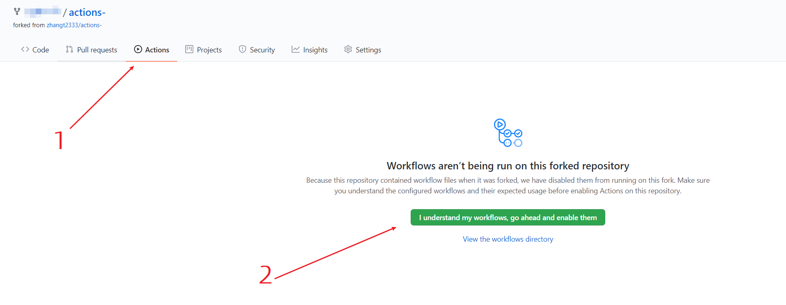
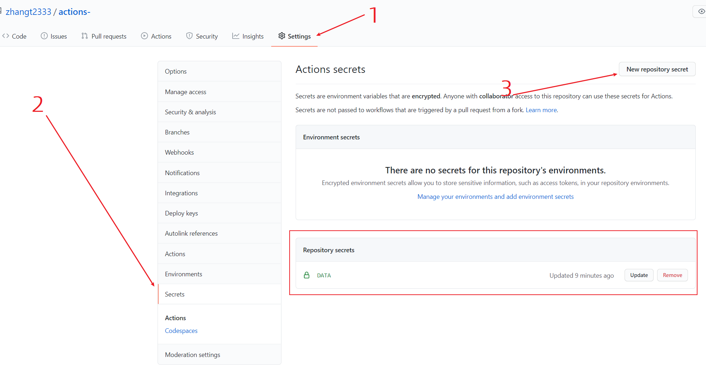
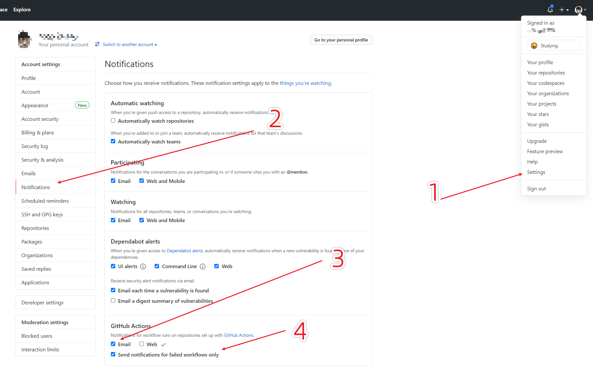

<div align="center">
<h1 align="center">自动健康填报助手</h1>
</div>

## 简介

每天 17:00, 19:00 GMT+8 触发任务，并延迟随机时间后完成健康填报。如想修改定时运行的时间，可修改 `.github/workflows/healthReport.yml` 中 `schedule` 属性。

请先手动在 App 填报一次，之后将默认取昨天的地址进行填报。

**如果当日有信息异常或地点更改，请手动在 APP 端填写！！！！！！！！！！！！**

请勿将本项目用于学习以外的用途。

## Github Actions 启用步骤

### 1. Fork 本项目

Fork 本项目: [actions-NjuHealthReport](https://github.com/zhangt2333/actions-NjuHealthReport) (Star 自然是更好)

### 2. 准备需要的参数

```
{
    # fill them:
    'username': '学号', # 把单引号内的 "学号" 改成自己的学号
    'password': '密码', # 把单引号内的 "密码" 改成自己的统一认证密码
    'deadline': '2021-10-05', # 这里填报截止日期（开区间），超过该天则停止填报并报错

    'none': 'none'
}
```

### 3. 启用 Github Actions



### 4. 将参数填到 Secrets

将填好的参数加入到 Secrets 中，name 为 `DATA`，value 为步骤 2 中的多行字符串



### 5. 配置自己账号的邮件提醒

如下图正确配置，这样运行失败的 Github Actions 事件会自动邮件通知你


## 为多人打卡

1. 依照 `Github Actions 启用步骤` 第 2、4 步，添加新的 Secret，假设命名为 `DATA2`  

2. 复制一遍 `.github/workflows/healthReport.yml` 中最后一行 `python health_report_helper/main.py "${{ secrets.DATA }}"` 并将其中的 `secrets.DATA` 中的 `DATA` 改为新 secrets 的键值。

3. 修改后的文件应如下所示（假设新键为`DATA2`）

```
  // .....
  - name: Run Spider
        run: |
          python health_report_helper/main.py "${{ secrets.DATA }}"
          python health_report_helper/main.py "${{ secrets.DATA2 }}"
```

# License

MIT：被授权人有权利在软件和软件的所有副本中包含版权声明和许可声明的前提下，使用、复制、修改、合并、出版发行、散布、再授权及贩售软件及软件的副本。授权人不为被授权人行为承担任何责任，且无义务对著作进行更新。